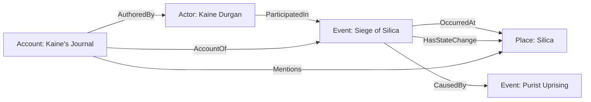
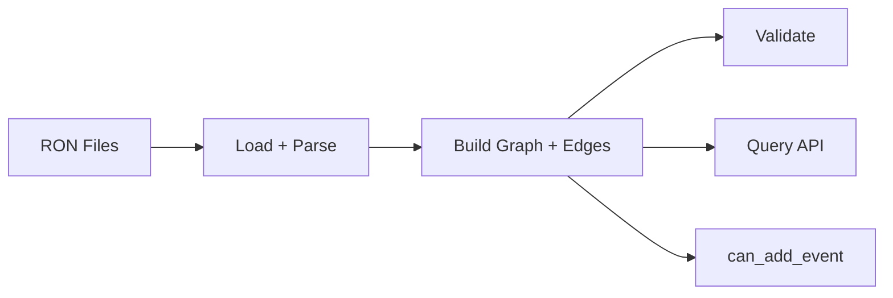
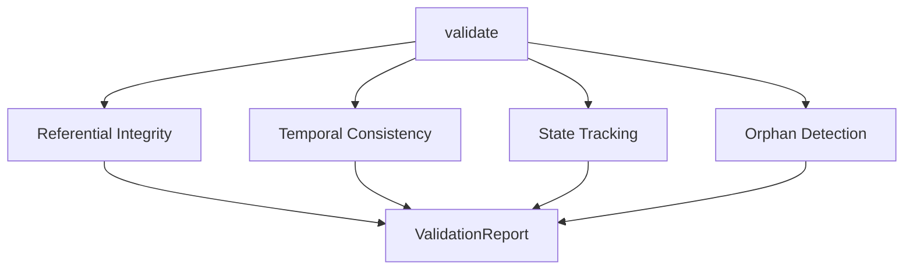

# Architecture

<!-- Generated: 2026-05-01 | tags: architecture, design, patterns -->

## Core Design: Event-Centric Knowledge Graph

Chronicle adapts the event-centric principle from CIDOC CRM (ISO 21127): **events are the connective tissue between actors, places, and time**. Instead of linking a character directly to a location, every connection passes through an event node that carries metadata (time, participants with roles and sentiment, location, causal links, state changes).

## Pipeline Architecture

The system is a linear pipeline — each stage consumes the output of the previous one, no feedback loops:

| Stage | Module | Mutates Graph? |
|-------|--------|----------------|
| Load | `graph.rs` | Yes (construction) |
| Build edges | `graph.rs` | Yes (construction) |
| Validate | `validation.rs` | No (read-only) |
| Query | `query.rs` | No (read-only) |
| can_add_event | `validation.rs` | No (read-only) |

After construction, the graph is immutable. All validation and query operations are pure reads.

## Graph Representation

Uses `petgraph::StableGraph<Entity, Relationship>` — a heterogeneous graph where:
- **Nodes** are `Entity` enum variants (Actor, Place, Event, Concept, Account)
- **Edges** are `Relationship` enum variants (10 types: ParticipatedIn, OccurredAt, CausedBy, etc.)
- **Index** is `HashMap<EntityId, NodeIndex>` for O(1) lookup by string ID

StableGraph chosen over Graph because node indices remain stable across removals (important for the ID→NodeIndex mapping).

## Validation Architecture

Four independent passes, each collecting errors without short-circuiting:

- **Referential**: All ID references in all fields resolve to existing nodes
- **Temporal**: Allen's Interval Algebra — lifespan checks, causal ordering
- **State**: Terminal statuses (configurable via `ValidationConfig`) block participation in later events
- **Orphan**: Zero in-degree AND zero out-degree = warning (not error)

`can_add_event` runs the same referential, temporal, and state checks against a proposed event without mutating the graph.

## Key Design Decisions

| Decision | Rationale |
|----------|-----------|
| petgraph StableGraph | Stable indices, built-in BFS/DFS/Dijkstra, enum node/edge types |
| Allen's intervals via `allen-intervals` crate | All 13 relations, discrete integer years, no reimplementation |
| RON format | Hand-authorable, nested structs readable, no parser to maintain |
| Directory-based type inference | `actors/*.ron` → `Vec<Actor>` — simpler than typed wrappers in files |
| ValidationConfig | Policy decisions (terminal statuses) are configurable, not hardcoded |
| Inclusive TimeSpan, exclusive Allen Interval | TimeSpan `{start: 10, end: 10}` → Allen `Interval {start: 10, end: 11}` |
| `strictly_before` = precedes ∨ meets | Adjacent years count as "before" in discrete domain |
| Accounts as graph nodes | Subjective layer on top of objective graph — no separate graph type |
