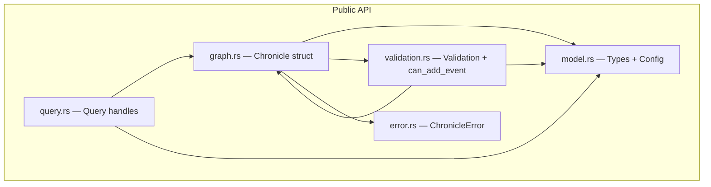

# Components

<!-- Generated: 2026-05-01 | tags: components, modules, responsibilities -->

## Module Map

## model.rs — Core Types

Defines all domain types. Everything is `Serialize + Deserialize` for RON compatibility.

**Entity types** (5): Actor, Place, Event, Concept, Account
**Sub-type enums**: ActorType (Character/Faction/Deity/Organization/Creature), PlaceType, EventType, ConceptType
**Behavioral enums**: Status (9 variants), Sentiment (14 variants), Role (9 variants), Fidelity (6 variants), StateChange (4 variants)
**Graph enums**: Entity (node wrapper), Relationship (10 edge types)
**Config**: ValidationConfig with `terminal_statuses: HashSet<Status>`

## graph.rs — Chronicle (Graph Builder)

The central struct. Owns the graph, the ID index, and the validation config.

**Construction**: `from_directory(path)` / `from_directory_with_config(path, config)` — walks subdirectories (`actors/`, `places/`, `events/`, `concepts/`, `accounts/`), deserializes RON files as `Vec<T>`, builds nodes, then constructs edges in a separate pass.

**Edge construction**: Collects `(NodeIndex, target_id, Relationship)` tuples first, then resolves target IDs via the HashMap. Dangling references are silently skipped (caught by validation).

**Utilities**: `parse_references(text)` scans `{entity_id}` patterns from account text.

## query.rs — Typed Query API

Four query handle types, each borrowing `&Chronicle`:

| Handle | Entry point | Key methods |
|--------|-------------|-------------|
| `ActorQuery` | `.actor(id)` | `events()`, `events_during()`, `events_at()`, `interactions()`, `status_at()` |
| `EventQuery` | `.event(id)` | `participants()`, `participants_by_role()`, `location()`, `caused_by()`, `causal_chain()`, `consequences()`, `state_changes()` |
| `PlaceQuery` | `.place(id)` | `events()`, `events_during()`, `actors_present_at()`, `status_at()` |
| `ConceptQuery` | `.concept(id)` | `origin_event()` |

**Text retrieval** on Chronicle directly: `mentions(entity_id)`, `accounts_of(event_id)`, `accounts_by(source_id)`

**Edge traversal**: `neighbors_by_edge(nx, direction, predicate)` — filters edges by Relationship variant, avoiding the pitfall of `neighbors_directed` which ignores edge types.

**InteractionResult**: Returned by `ActorQuery::interactions()`, provides `.all()`, `.people()`, `.factions()` filters.

## validation.rs — Validation Engine

**Full graph validation**: `validate(&Chronicle) -> ValidationReport` — runs 4 passes (referential, temporal, state, orphan), collects all errors and warnings.

**Insertion verification**: `can_add_event(&Chronicle, &Event) -> Result<(), Vec<ValidationError>>` — checks a proposed event against the existing graph without mutation. Runs referential, temporal, and state checks.

**Report types**: `ValidationReport { errors, warnings }`, `ValidationError` (3 variants: DanglingReference, TemporalViolation, StateViolation), `ValidationWarning` (2 variants: OrphanEntity, TemporalAmbiguity).

**Temporal helpers**: `to_interval()` converts inclusive TimeSpan to exclusive Allen Interval. `strictly_before()` checks precedes ∨ meets for discrete adjacent-year semantics.

## error.rs — Error Types

`ChronicleError` with 7 variants: EntityNotFound, DuplicateId, DanglingReference, TemporalViolation, StateViolation, Parse (from RON), Io. Used for load-time errors. Validation errors use the separate `ValidationError` enum.
