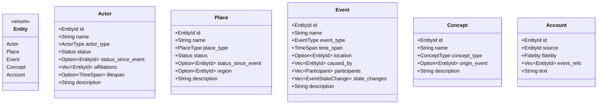

# Data Models

<!-- Generated: 2026-05-01 | tags: data-models, types, enums -->

## Entity Types

## Relationship Types (Edge Enum)

| Variant | Direction | Data |
|---------|-----------|------|
| ParticipatedIn | Event → Actor | `{ role: Role, sentiment: Sentiment }` |
| OccurredAt | Event → Place | — |
| CausedBy | Event → Event (effect → cause) | — |
| HasStateChange | Event → Entity | `{ change: StateChange }` |
| AffiliatedWith | Actor → Actor (member → faction) | — |
| OriginatedFrom | Concept → Event | — |
| AccountOf | Account → Event | — |
| AuthoredBy | Account → Actor | — |
| Mentions | Account → Entity | — |
| LocatedIn | Place → Place (child → parent region) | — |

## Sub-Type Enums

| Enum | Variants |
|------|----------|
| ActorType | Character, Faction, Deity, Organization, Creature |
| PlaceType | Settlement, Region, Dungeon, Landmark, Ruin |
| EventType | Battle, Siege, Discovery, Political, Migration, Death, Founding, Catastrophe, Ritual |
| ConceptType | Religion, Technology, Artifact, Law, Tradition |

## Behavioral Enums

| Enum | Variants |
|------|----------|
| Status | Active, Dead, Destroyed, Dissolved, Evacuated, Captured, Transformed, Corrupted, Unknown |
| Sentiment | Triumphant, Vindicated, Dutiful, Determined, Righteous, Transformative, Neutral, Sorrowful, Fearful, Desperate, Defiant, Devastating, Resentful, Fractured |
| Role | Attacker, Defender, Leader, Participant, Witness, Discoverer, Instigator, Victim, Mediator |
| Fidelity | Canonical, Partial, Distorted, Biased, Fabricated, Corrupted |
| StateChange | StatusChange(Status), Founded, AffiliationAdded(EntityId), AffiliationRemoved(EntityId) |

## Supporting Types

| Type | Fields | Notes |
|------|--------|-------|
| `EntityId` | `String` alias | Stable string identifier |
| `TimeSpan` | `start: i32, end: i32` | Inclusive bounds, integer years |
| `Participant` | `actor: EntityId, role: Role, sentiment: Sentiment` | Per-event participation record |
| `EventStateChange` | `entity: EntityId, change: StateChange` | State change produced by an event |
| `ValidationConfig` | `terminal_statuses: HashSet<Status>` | Policy: which statuses block future participation |

## Serde Conventions

- All public types derive `Serialize + Deserialize`
- `#[serde(rename = "type")]` on type-discriminator fields (e.g., `actor_type`)
- `#[serde(default)]` on optional/collection fields for ergonomic RON authoring
- `#[serde(default = "default_status")]` defaults Status to Active
