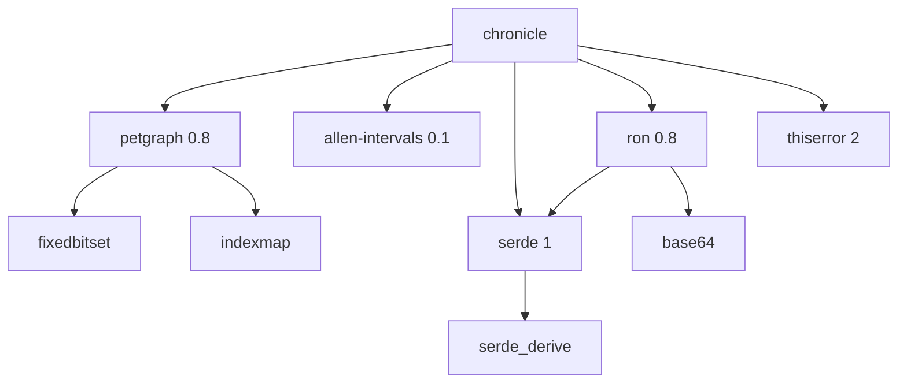

# Dependencies

<!-- Generated: 2026-05-01 | tags: dependencies, crates, integration -->

## Dependency Graph

## Dependency Details

### petgraph 0.8

**Purpose**: Graph data structure and traversal algorithms.

**Features enabled**: `serde-1` (graph serialization), `stable_graph` (stable node indices across removals).

**Integration**: `StableGraph<Entity, Relationship>` is the core data structure. Used for node/edge storage, directed edge traversal (`edges_directed`), neighbor iteration, and BFS for causal chain traversal. The `Entity` and `Relationship` enums wrap the heterogeneous node/edge types.

**Why StableGraph**: Node indices remain valid after removals. Critical because `HashMap<EntityId, NodeIndex>` maps string IDs to graph indices — these must stay stable.

### allen-intervals 0.1

**Purpose**: Allen's Interval Algebra — 13 temporal relations between time intervals.

**Integration**: Used in `validation.rs` for temporal consistency checks. `TimeSpan` (inclusive bounds) is converted to Allen's `Interval` (exclusive end for discrete domain) via `to_interval()`. The `Precedes` and `Meets` traits are used through the `strictly_before()` helper.

**Key detail**: Discrete integer intervals use exclusive end bounds. `Interval { start: 10, end: 10 }` is empty. Chronicle's `TimeSpan { start: 10, end: 10 }` must become `Interval { start: 10, end: 11 }`.

### serde 1 + ron 0.8

**Purpose**: Serialization framework and RON format parser.

**Integration**: All public types derive `Serialize + Deserialize`. RON files are deserialized directly into typed structs (`Vec<Actor>`, `Vec<Event>`, etc.). The `#[serde(rename = "type")]` attribute handles the `type` keyword collision with Rust. `#[serde(default)]` makes optional fields ergonomic in hand-authored RON.

### thiserror 2

**Purpose**: Derive macro for `std::error::Error` on `ChronicleError`.

**Integration**: `ChronicleError` uses `#[derive(Error)]` with `#[error("...")]` format strings and `#[from]` for automatic conversion from `ron::error::SpannedError` and `std::io::Error`.

## No Dev Dependencies

The test suite uses only the crate's own types and `std`. No test framework beyond `cargo test`.

## Dependency Philosophy

Minimal. No async, no database, no network, no GPU. The entire dependency tree is:
- Graph structure (petgraph)
- Temporal logic (allen-intervals)
- Serialization (serde + ron)
- Error handling (thiserror)
