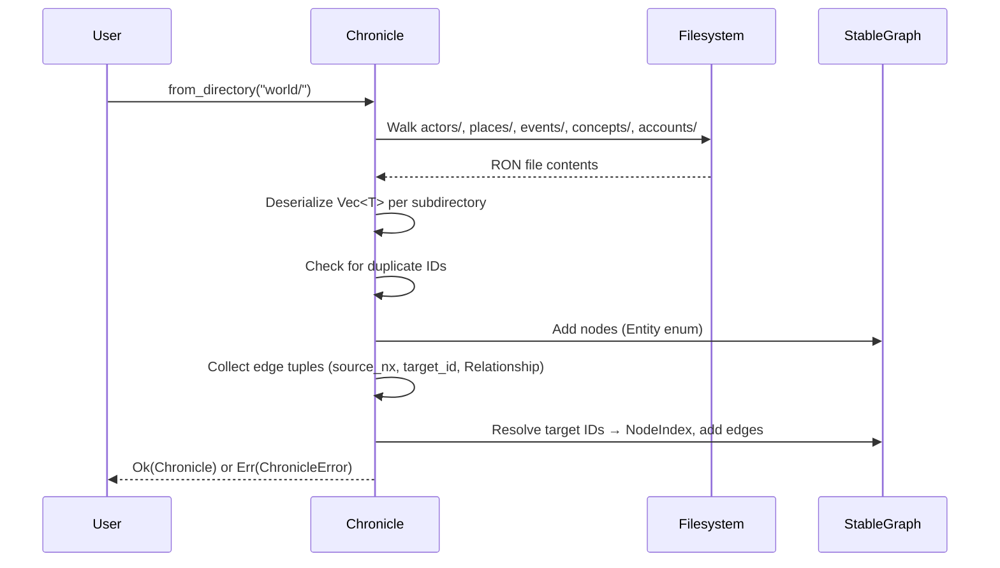
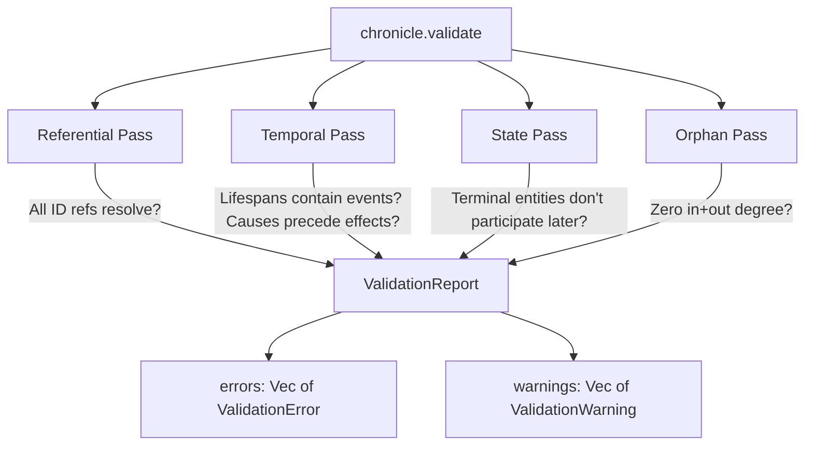
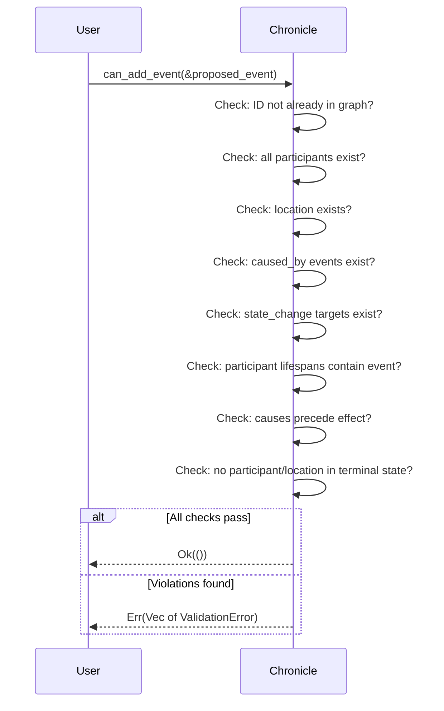
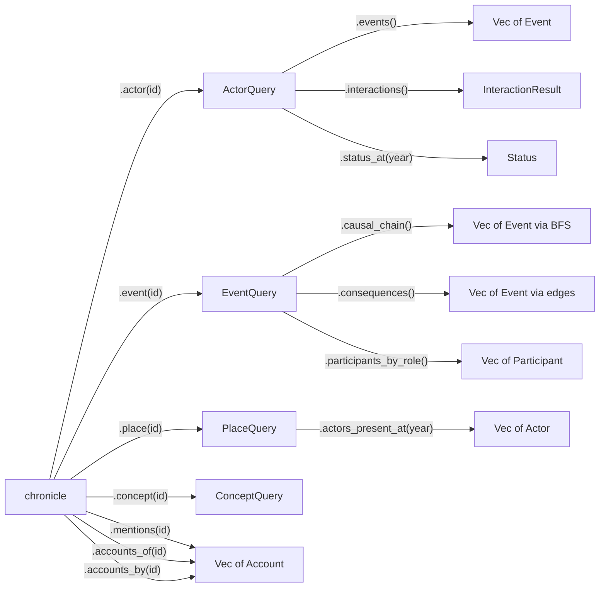
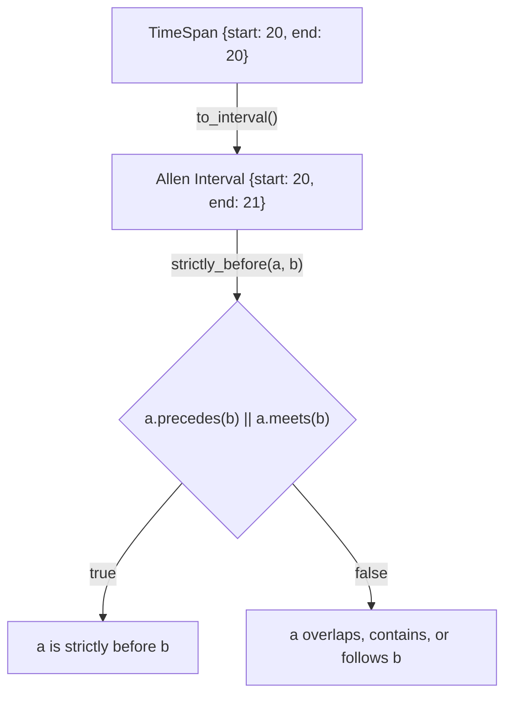

# Workflows

<!-- Generated: 2026-05-01 | tags: workflows, processes, pipelines -->

## Loading a World



Type inference: subdirectory name determines the deserialization target. `actors/*.ron` → `Vec<Actor>`, etc. Files within a subdirectory can have any name.

## Validating a Graph



All passes run independently. Errors are collected, not short-circuited.

## Checking a Proposed Event



Pure check — does not mutate the graph.

## Querying the Graph



All queries are read-only borrows. Return `Option` for single lookups, `Vec` for collections.

## Authoring Content

```
1. Create RON files in the appropriate subdirectory:
   world/actors/my_characters.ron → Vec<Actor>
   world/events/my_events.ron    → Vec<Event>

2. Use {entity_id} references in account text:
   text: "The {mirror_order} attacked {silica}."

3. Load and validate:
   let graph = Chronicle::from_directory("world/")?;
   let report = graph.validate();

4. Check proposed additions:
   graph.can_add_event(&new_event)?;
```

## Temporal Verification Detail



Key: TimeSpan uses inclusive bounds. Allen's discrete intervals use exclusive end. The conversion adds 1 to the end. `strictly_before` combines `precedes` (gap between intervals) and `meets` (adjacent, no gap) to handle the discrete year boundary correctly.
